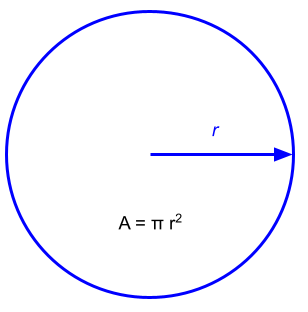
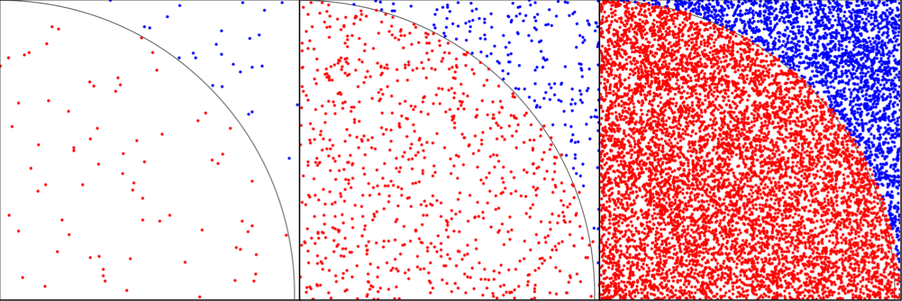
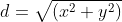
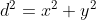

## Introduction for instructors

This page describes a course module for teaching parallelism with OpenMPI in Python. The materials are adapted from those used in teaching the BIO 371 DIVAS Seminar II, which was the capstone course for our [Digital Imaging and Vision Applications in Science (DIVAS)](https://www.nsf.gov/awardsearch/showAward?AWD_ID=1608754&HistoricalAwards=false) program. The course description for this course is:

>This seminar is a capstone to the Doane Digital Imaging and Vision 
>Applications in Science Project and is intended for DIVA scholars. Students 
>mentor incoming DIVA scholars by occasionally participating in DIVAS 
>Seminar I. Students will develop and present a summary of their research to 
>students in DIVAS Seminar I, most likely at MindExpo. Finally, students 
>will explore various ways to use supercomputing and parallelism to solve a 
>variety of problems. DIVA scholars are required to enroll in this course 
>after completing summer research.
> 
>Some specific activities for our semester are listed below:
> 
>- Git, bash, Python, OpenCV review 
>- Use of Onyx or other supercomputer
>    - Parallel architectures, problem-solving methodologies, etc.
>    - When / what to parallelize
>    - Language-specific implementation
>    - SLURM batch files, etc. 
>- Solving a variety of problems from different disciplines
>    - Application of above in a project 
>- Mentoring DIVAS I cohort
>- MindExpo presentation regarding DIVAS I activities / summer research

The DIVAS Seminar II course was taught to non-computing majors who had minimal programming experience. So, our approach was to introduce the subject of parallelism in as simple a way as possible. 

---

## Module introduction

We will use a single problem to motivate our discussion for this module: estimating the mathematical constant *π*. There are a wide variety of different infinite series formulae for estimating *π*, but the approach we will take here uses a *Monte Carlo method*, which means that it relies on randomness. 

### Using a circle's area to estimate *π*

Consider the formula for calculating the area of a circle with radius *r*:



If we use one for the radius of our circle, then the area formula simplifies to:

*A = π*.

And, suppose we look at only one quarter of the circle, say, the upper right quadrant. Then, we would have

*A = π / 4*.

We're trying to find an estimate of *π*, so solving for *π* in the last equation gives us:

*π = 4A*.

So, if we have a way to estimate the area of one quadrant of a unit circle, we can multiply that by four and arrive at an estimate of *π*. 

### The Monte Carlo method

To find the area of our circle quadrant, we're going to pretend that the unit square containing the quadrant is a dart board, and throw lots and lots of virtual darts at it! 

Our Monte Carlo method works like this: we'll generate many, many *(x, y)* coordinates, where each *x* and *y* is a randomly chosen number in the range *[0, 1)*. For each coordinate, we will calculate the distance from the origin *(0, 0)* to the point *(x, y)*. If that distance is less than or equal to one, then the point lands inside the unit circle quadrant; if the distance is greater than one, then the point landed outside the circle quadrant. We will count how many of our darts / coordinates were inside the circle, and if we throw enough darts, dividing that number by the total number of darts thrown will give us an estimate of the area of the circle quadrant. 

This image may help you understand the process. The leftmost image shows our dartboard after just a few darts were thrown; those that are inside the circle quadrant are colored red, while those outside the quadrant are blue. The middle image has more darts, and the rightmost image has even more. 



As we have more and more darts, the ratio of red to blue points will be closer and closer to the area of the circle quadrant.

In order to determine if a dart is inside the circle quadrant, we need to calculate its distance from the origin. Generally speaking, the distance between two points *(x<sub>1</sub>, y<sub>1</sub>)* and *(x<sub>2</sub>, y<sub>2</sub>)* can be determined by this formula:


We can simplify things to make the formula simpler and faster to calculate. First, recall that one of our points in this situation is always *(0, 0)*. Let's assume that *(x<sub>1</sub>, y<sub>1</sub>) = (0, 0)*. Now, the subtractions are eliminated, because subtracting zero from any value leaves you with the same value. So, our distance formula is now:



Squaring both sides, we have:



We are interested in the case where *d ≤ 1*. Squaring both sides of that inequality, we have *d<sup>2</sup> ≤ 1<sup>2</sup> = 1*. So, if the Boolean expression `x * x + y * y <= 1.0` is true, our dart was inside the circle quadrant. 

## Python solution, take one

Here is a Python function to implement our Monte Carlo method of estimating *π*. 

```python

def monte_pi(n):
    '''
    Use a Monte Carlo method to estimate the value of π.

    parameters
    ----------
    n : integer
      Number of "darts" to throw at a unit circle quadrant.

    returns
    -------
    Estimate of π, as a floating-point number.
    '''
    import random

    num_in = 0
    for i in range(n):
        x = random.random() # random number in [0, 1)
        y = random.random()
        if x * x + y * y <= 1.0:
            num_in += 1
    
    return 4.0 * num_in / n
```

We use the `for` statement to throw our darts, and the `random.random()` method to get the *(x, y)* value for each dart. Then, we use our simplified distance formula to determine if each dart landed inside the circle quadrant. We use an accumulator pattern to keep track of how many darts landed inside the quadrant. Finally, we return four times our area estimate as our estimate of *π*. 

We called this function for 100, 10,000, and 10,000,000 darts, and as expected, the estimate of *π* gets better as the number of darts increases.

```
Estimate using 100 darts: 3.040000
Estimate using 10000 darts: 3.145600
Estimate using 10000000 darts: 3.141642
```

There is one problem, however. As the number of darts increases, it takes longer and longer for our code to execute. So, is there a way to speed things up? Well, now that you asked...

## Parallelism with OpenMPI

One way we can speed up our Monte Carlo simulation is *parallelism*. The previous Python code uses a single *Central Processing Unit (CPU) core* -- think of this as a single computer -- to do its work. But, modern computers have multiple CPU cores; the author's desktop has eight. And, there are *cluster computers* that have hundreds or thousands of cores. In parallelism, we use more than one core at the same time, all working on the same problem, to speed up our program. Here, we will see how we can use *OpenMPI* to parallelize our Monte Carlo estimation of *π*.

### Introduction to OpenMPI

The *Message Passing Interface (MPI)* is a standard way to use parallelism, especially on cluster computers. Here we will use an open source implementation of MPI, OpenMPI. 

The key concept in MPI is *message passing*. That is, all of the different processors we have working on our problem will communicate with each other by sending messages back and forth. These messages will be either data (e.g., the number of darts that landed in the circle quadrant) or control information (e.g, here's how many darts you should throw). 

In an MPI program the group of processors working together is called a *communicator group*. Inside the group, each processor is assigned a unique integer number, called its *rank*. The process with rank zero is known as the *root process*; it is responsible for organizing the work that the remaining processors will do. We will call the non-root processes *drones*. 

Each processor in the communicator group will be running the same program. So, we will use logic (an `if` / `else` statement) to separate the code the root process should execute from the code the drone processes should use. 

```python

import datetime
import random

# we need this import to use MPI in our Python code
from mpi4py import MPI 

def monte_pi_count(seed, n):
    '''
    Count how many darts land in the unit circle quadrant in a Monte Carlo
    estimation of π.

    parameters
    ----------
    seed : integer
      Seed value for the random number generator.
    n : integer 
      Number of "darts" to throw at a unit circle quadrant.

    returns
    -------
    Number of darts that landed inside the unit circle quadrant.
    '''
    import random

    # seed the random number generator
    random.seed(seed)

    num_in = 0
    for i in range(n):
        x = random.random()
        y = random.random()
        if x * x + y * y <= 1.0:
            num_in += 1

    return num_in

###############################################################################
# main program                                                                #
###############################################################################

# The following collects information about the process. We will almost always 
# need the rank, but the others are just illustrative in this example.

# get the communications object
comm = MPI.COMM_WORLD

# get total number of processors
size = comm.Get_size()

# get rank of current processor
rank = comm.Get_rank()

# get name of the processor
name = MPI.Get_processor_name()

# just for illustration, each process (root and drones) prints the information
# it gathered.
print(size, rank, name)

# define a tag number for the messages we will pass
COUNT_FROM_DRONE = 1

# constant for number of darts each drone throws
N = 10000000

if rank == 0:
    ###########################################################################
    # root processor section                                                  #
    ###########################################################################
    
    # accumulate the number of darts in the unit circle quadrant from each of 
    # the drone processes
    count_acc = 0
    for proc in range(1, size): # proc is rank of each drone process
        # get messages from each drone, with their count. Parameters:
        #     source: rank number of drone process to receive from
        #     tag: number identifying which type of message to look for
        count = comm.recv(source = proc, tag = COUNT_FROM_DRONE)

        # illustrative only: report counts from each drone
        print('Received count {0:d} from processor {1:d}'.format(count, proc))

        # accumulate the value received
        count_acc += count

    # now estimate π
    pi = 4.0 * count_acc / ((size - 1) * N)

    # print our results
    print('Estimate of pi: {0:f}'.format(pi))

    # root process is complete!

else:
    ###########################################################################
    # drone processor section                                                 #
    ###########################################################################

    # each processor needs to have a different random number seed, otherwise 
    # they all will do exactly the same thing. So, use the current time in
    # microseconds, plus the drone's rank, as a seed value
    seed = datetime.datetime.now().microsecond + rank

    # count number of darts in the unit circle quadrant, for this drone
    count = monte_pi_count(seed, N)

    # illustrative only: print out this drone's count
    print('Drone process {0:d} count: {1:d}'.format(rank, count))

    # send the count value back to the root process. Parameters:
    #   count: the value we're sending
    #   dest: which process we're sending it to; in this case, the root
    #   tag: number identifying which type of message we're sending
    comm.send(count, dest = 0, tag = COUNT_FROM_DRONE)

    # and that's it! Drone process is complete
```

```
8 2 LI231.doane.local
Drone process 2 count: 7853298
8 1 LI231.doane.local
Drone process 1 count: 7856538
8 3 LI231.doane.local
Drone process 3 count: 7852901
8 4 LI231.doane.local
Drone process 4 count: 7855042
8 7 LI231.doane.local
Drone process 7 count: 7853070
8 5 LI231.doane.local
Drone process 5 count: 7853401
8 6 LI231.doane.local
Drone process 6 count: 7855272
8 0 LI231.doane.local
Received count 7856538 from processor 1
Received count 7853298 from processor 2
Received count 7852901 from processor 3
Received count 7855042 from processor 4
Received count 7853401 from processor 5
Received count 7855272 from processor 6
Received count 7853070 from processor 7
Estimate of pi: 3.141687
```
