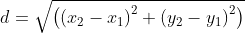

## Introduction for instructors

This page describes a course module for teaching parallelism with OpenMPI in Python. The materials are adapted from those used in teaching the BIO 371 DIVAS Seminar II, which was the capstone course for our [Digital Imaging and Vision Applications in Science (DIVAS)](https://www.nsf.gov/awardsearch/showAward?AWD_ID=1608754&HistoricalAwards=false) program. The course description for this course is:

>This seminar is a capstone to the Doane Digital Imaging and Vision 
>Applications in Science Project and is intended for DIVA scholars. Students 
>mentor incoming DIVA scholars by occasionally participating in DIVAS 
>Seminar I. Students will develop and present a summary of their research to 
>students in DIVAS Seminar I, most likely at MindExpo. Finally, students 
>will explore various ways to use supercomputing and parallelism to solve a 
>variety of problems. DIVA scholars are required to enroll in this course 
>after completing summer research.
> 
>Some specific activities for our semester are listed below:
> 
>- Git, bash, Python, OpenCV review 
>- Use of Onyx or other supercomputer
>    - Parallel architectures, problem-solving methodologies, etc.
>    - When / what to parallelize
>    - Language-specific implementation
>    - SLURM batch files, etc. 
>- Solving a variety of problems from different disciplines
>    - Application of above in a project 
>- Mentoring DIVAS I cohort
>- MindExpo presentation regarding DIVAS I activities / summer research

The DIVAS Seminar II course was taught to non-computing majors who had minimal programming experience. So, our approach was to introduce the subject of parallelism in as simple a way as possible. 

---

## Module introduction

We will use a single problem to motivate our discussion for this module: estimating the mathematical constant *π*. There are a wide variety of different infinite series formulae for estimating *π*, but the approach we will take here uses a *Monte Carlo method*, which means that it relies on randomness. 

### Using a circle's area to estimate *π*

Consider the formula for calculating the area of a circle with radius *r*:

If we use one for the radius of our circle, then the area formula simplifies to:

*A = π*.

And, suppose we look at only one quarter of the circle, say, the upper right quadrant. Then, we would have

*A = π / 4*.

We're trying to find an estimate of *π*, so solving for *π* in the last equation gives us:

*π = 4A*.

So, if we have a way to estimate the area of one quadrant of a unit circle, we can multiply that by four and arrive at an estimate of *π*. 

### The Monte Carlo method

To find the area of our circle quadrant, we're going to pretend that the unit square containing the quadrant is a dart board, and throw lots and lots of virtual darts at it! 

Our Monte Carlo method works like this: we'll generate many, many *(x, y)* coordinates, where each *x* and *y* is a randomly chosen number in the range *[0, 1)*. For each coordinate, we will calculate the distance from the origin *(0, 0)* to the point *(x, y)*. If that distance is less than or equal to one, then the point lands inside the unit circle quadrant; if the distance is greater than one, then the point landed outside the circle quadrant. We will count how many of our darts / coordinates were inside the circle, and if we throw enough darts, dividing that number by the total number of darts thrown will give us an estimate of the area of the circle quadrant. 

This image may help you understand the process. The leftmost image shows our dartboard after just a few darts were thrown; those that are inside the circle quadrant are colored red, while those outside the quadrant are blue. The middle image has more darts, and the rightmost image has even more. 

As we have more and more darts, the ratio of red to blue points will be closer and closer to the area of the circle quadrant.

In order to determine if a dart is inside the circle quadrant, we need to calculate its distance from the origin. Generally speaking, the distance between two points *(x1, y1)* and *(x2, y2)* can be determined by this formula:

We can simplify things to make the formula simpler and faster to calculate. First, recall that one of our points in this situation is always *(0, 0)*. Let's assume that *(x1, y1) = (0, 0)*. Now, the subtractions are eliminated, because subtracting zero from any value leaves you with the same value. So, our distance formula is now:

Squaring both sides, we have:

We are interested in the case where *d ≤ 1*. Squaring both sides of that inequality, we have *d2 ≤ 12 = 1*. So, if the Boolean expression `x * x + y * y <= 1.0` is true, our dart was inside the circle quadrant. 

## Python solution, take one

